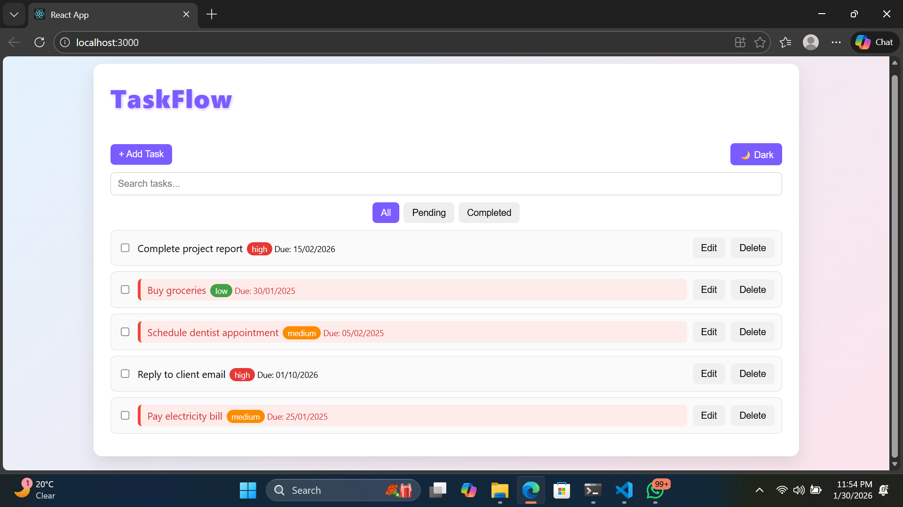
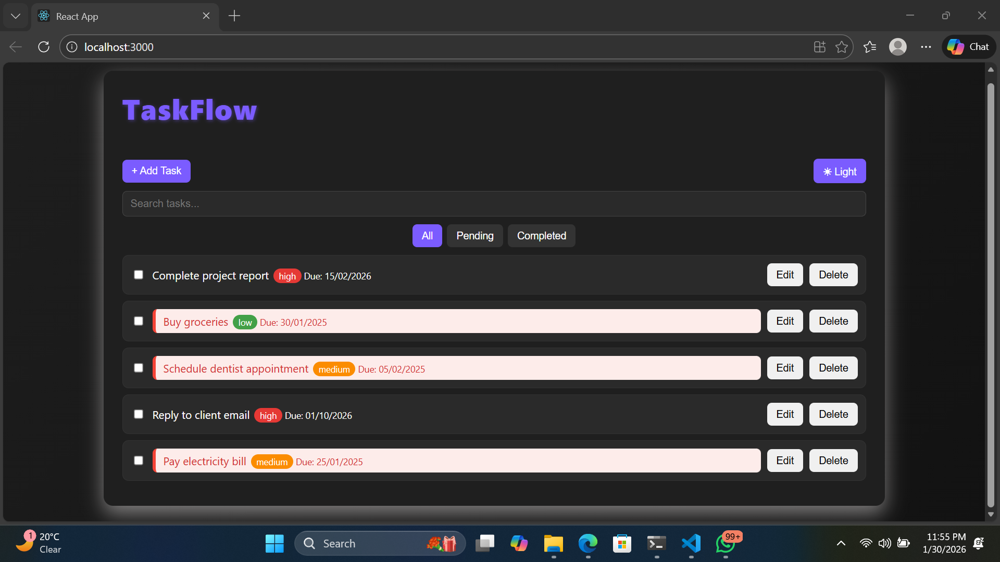
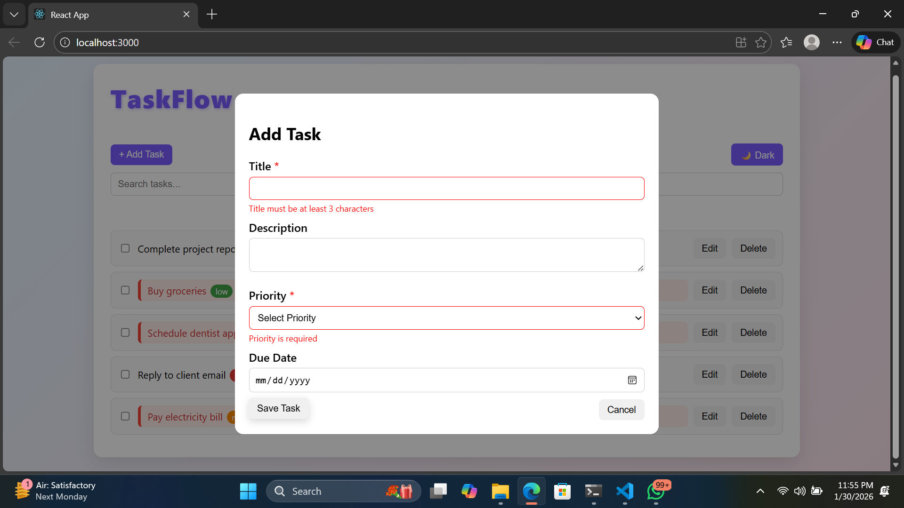
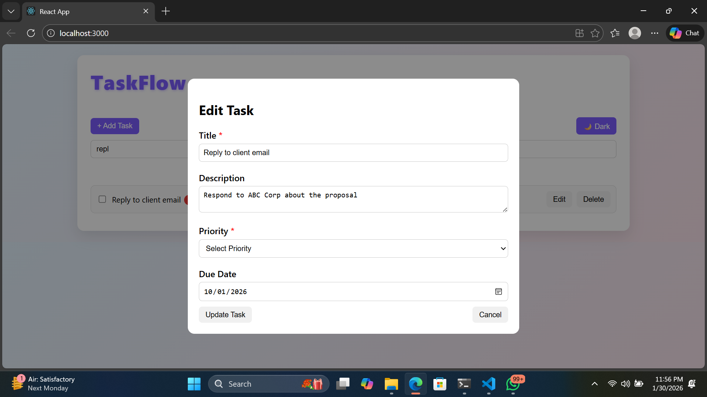
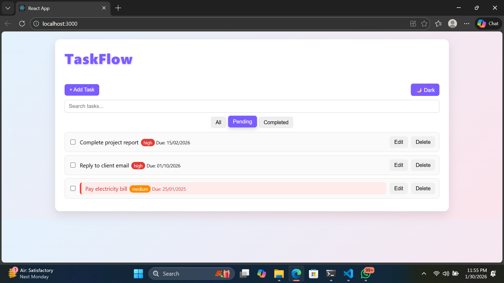
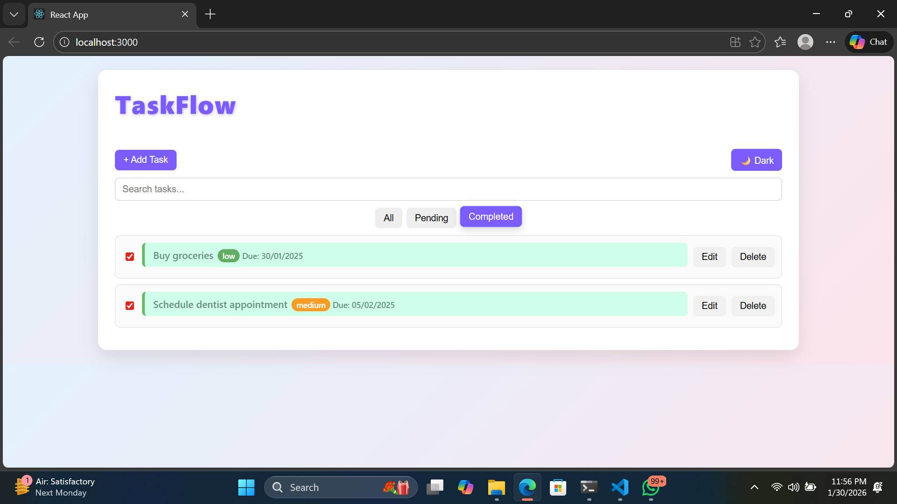
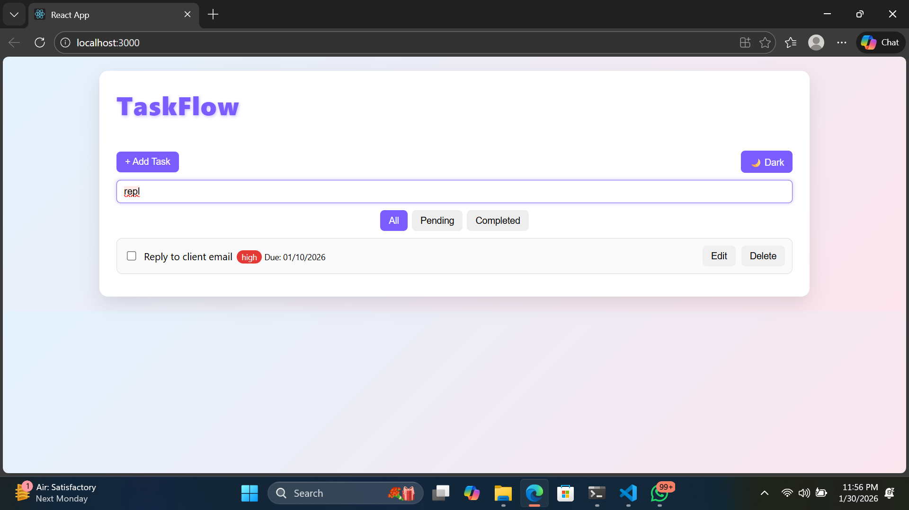
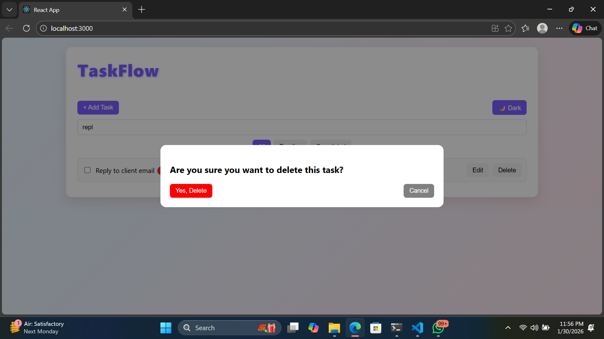

# TaskFlow – Task Management Application

TaskFlow is a modern task management application built with React that helps users
organize their daily tasks efficiently. It supports task creation, editing,
drag-and-drop reordering, priority tagging, and dark mode with data persistence.

## Technologies Used
- React.js
- JavaScript (ES6)
- HTML5
- CSS3
- @hello-pangea/dnd
- LocalStorage

## Installation and Setup

1. Clone the repository
   git clone https://github.com/anushribindod/TaskFlow.git

2. Navigate to the project folder
   cd TaskFlow

3. Install dependencies
   npm install

4. Start the application
   npm start

5. Open your browser and visit
   http://localhost:3000

## Features Implemented
- Add, edit, and delete tasks
- Drag-and-drop task reordering
- Search and filter tasks
- Priority-based task labels
- Overdue task highlighting
- Dark mode toggle with persistence
- LocalStorage-based data saving

## Screenshots
### Dashboard – Light Mode

### Dashboard – Dark Mode

### Add Task Modal

### Edit Task Modal

### Pending Tasks View

### Completed Tasks View

### Search Functionality

### Delete Confirmation Popup
